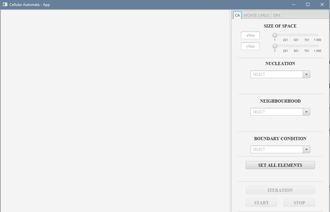

# CA_MC_DRX

To create this project we use Java 16.

## Description

This is project with GUI. GUI is implemented by the use of javafx library. 

This project has implemented 3 methods:
* Cellular Automata
* Monte Carlo
* DRX

## Visuals

## Installation

Put this files in a separate folder. 

And if you use IntelliJ you should create a new project in this folder. 

Then you should open Run > Edit Configurations... > Modify options > Add VM options and add in created field (VM options) this:

--module-path \javafx-sdk-16\lib (here is adress of your javafx sdk folder)

 --add-modules javafx.controls,javafx.fxml --add-exports javafx.graphics/com.sun.javafx.sg.prism=ALL-UNNAMED